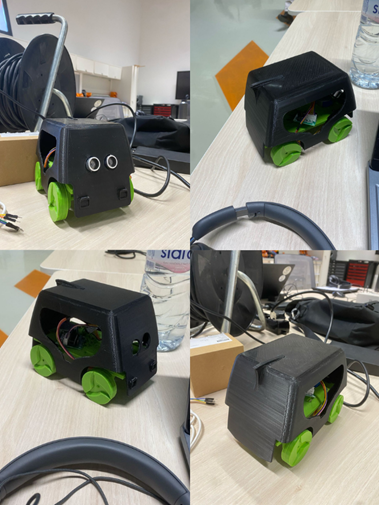

# Educational Robot

An affordable educational robotics platform designed to teach programming concepts to children aged 7-12 through hands-on interaction with a physical robot (developed as part of my engineering final year project internship).

<!--//-->

## 🎯 Project Overview

This project bridges the gap between simple toy robots and expensive educational kits by providing a **sub-$40 solution** that delivers comparable learning outcomes. The system combines:

- **ESP32-based hardware** with stepper motors and sensors
- **Flutter mobile app** with visual block programming
- **Progressive learning system** from basic commands to autonomous navigation
- **Real-time telemetry** for immediate feedback

## ✨ Key Features

- 📱 **Mobile-first design** - Works on any smartphone/tablet
- 💰 **Affordable** - Total cost under $40
- 🎮 **Visual programming** - Custom block-based interface
- 🤖 **Autonomous navigation** - Enhanced E-Bug algorithm
- 📊 **Real-time feedback** - Live sensor data visualization
- 🌐 **Offline capable** - No internet required after setup
- 🔓 **Open source** - MIT license for educational use

## 🚀 Quick Start

### Prerequisites
- ESP32 development board
- 3D printer for chassis parts
- Android/iOS device for programming
- Basic soldering skills

### Hardware Assembly
1. 3D print chassis components from `/hardware/3d-models/`
2. Follow the [Assembly Guide](docs/assembly-guide.md)
3. Upload firmware using Arduino IDE or PlatformIO

### Software Setup
1. Install the mobile app (APK available in releases)
2. Pair with robot via Bluetooth
3. Start with Level 1 programming challenges

## 📚 Documentation

- [**Assembly Guide**](docs/assembly-guide.md) - Step-by-step hardware build
- [**User Manual**](docs/user-manual.md) - How to use the system
- [**Development Setup**](docs/development-setup.md) - For contributors
- [**Curriculum Guide**](curriculum/README.md) - Educational activities

## 🏗️ Project Structure

```
├── hardware/          # CAD files, STL models, schematics
├── firmware/          # ESP32 Arduino code
├── mobile-app/        # Flutter application
├── curriculum/        # Educational materials
├── docs/             # Documentation and guides
└── research/         # Studies and evaluation results
```

## 📋 Bill of Materials

| Component | Quantity | Est. Cost | Notes |
|-----------|----------|-----------|-------|
| ESP32-WROOM-32 | 1 | $8 | Main microcontroller |
| Stepper Motors (28BYJ-48) | 2 | $6 | With ULN2003 drivers |
| HC-SR04 Ultrasonic | 1 | $3 | Distance sensor |
| MPU6050 IMU | 1 | $4 | Orientation tracking |
| Li-Po Battery 7.4V | 1 | $8 | 2000mAh capacity |
| 3D Printing Filament | ~200g | $6 | PLA recommended |
| Miscellaneous | - | $5 | Wires, screws, etc. |
| **Total** | | **~$40** | |

## 🎓 Educational Impact

Based on testing with 24 students aged 7-12:

- **89% average improvement** in programming concept understanding
- **100% success rate** for basic programming tasks
- **75% success rate** for autonomous navigation programming
- **45 minutes average** sustained engagement time

## 🛠️ Development

### Building the Firmware
```bash
cd firmware/
# Using PlatformIO
pio run --target upload

# Using Arduino IDE
# Open main.cpp and upload to ESP32
```

### Building the Mobile App
```bash
cd mobile-app/
flutter pub get
flutter run
```

## 🤝 Contributing

We welcome contributions! Please see [CONTRIBUTING.md](CONTRIBUTING.md) for guidelines.

### Areas for Contribution
- [ ] iOS app development
- [ ] Additional language translations
- [ ] Curriculum expansion
- [ ] Hardware improvements
- [ ] Bug fixes and optimizations

## 📊 Performance Benchmarks

- **Movement Accuracy**: ±2cm per meter
- **Battery Life**: ~90 minutes continuous use
- **BLE Range**: 12+ meters
- **Command Latency**: <100ms
- **Setup Time**: 30 minutes average

## 🌍 Localization

Currently supported languages:
- English
- Arabic
- Looking for translators for French, Spanish, Portuguese

## 📄 License

This project is licensed under the MIT License - see the [LICENSE](LICENSE) file for details.

## 🙏 Acknowledgments

- **Euromed University of Fes** - Academic supervision
- **DICE/UM6P** - Host organization and support
- **Open source community** - Libraries and inspiration
- **Test participants** - Students and educators who provided feedback

## 📞 Contact

- **Author**: Mohamed Ayman OUCHKER
- **Email**: ayman.ouchker@outlook.com
- **Institution**: Euromed University of Fes
- **Project**: End of Studies Project 2024-2025

## 🌟 Star History

If this project helps you, please consider giving it a star! ⭐

---

**Made with ❤️ for democratizing robotics education**
