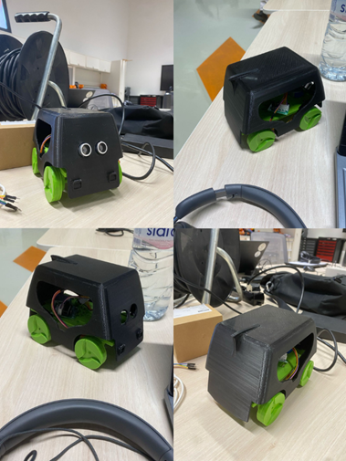

# Educational Robot

> **P1 development revision:** the app/firmware control path now targets the confirmed 28BYJ-48 + ULN2003 build. Use the [new wiring](hardware/wiring.md) and matching app/firmware together. Hardware validation, printable exports and research reconciliation remain open; see [P1 status and test results](docs/p1-status.md).

> **P2 update:** named local Save/Open, execution-based practice progress, Bluetooth-only connection controls and a matching five-level curriculum are implemented. See [P2 status, tests and remaining work](docs/p2-status.md).

> **Android packaging:** the selected release ID, upgraded build tools and private-signing workflow are documented in the [release guide](docs/android-release.md). Debug packages are labeled RoboCode (Test); physical acceptance and a signed distribution release remain open.

> **Physical build handoff:** use the corrected [assembly guide](docs/assembly-guide.md), [blank acceptance record](docs/hardware-acceptance.md) and [CAD inventory/export checklist](hardware/cad-release.md). CAD inspection awaits the owner's CATIA installation; no physical tests or exports are claimed complete.

An affordable educational robotics platform designed to teach programming concepts to children aged 7-12 through hands-on interaction with a physical robot (developed as part of my engineering final year project internship).




## 🎯 Project Overview

This prototype explores an affordable way to teach programming with a physical robot. The selected protected battery, regulator and external charger exceed the historical $40 parts estimate; see the [current parts selection and cost snapshot](hardware/power-system.md). A complete delivered build cost and comparative learning outcomes have not yet been established. The system combines:

- **ESP32-based hardware** with stepper motors and sensors
- **Flutter mobile app** with visual block programming
- **Progressive learning system** from basic commands to autonomous navigation
- **Real-time telemetry** for immediate feedback

## ✨ Key Features

- 📱 **Mobile-first design** - Flutter app with Android as the current build target
- 💰 **Cost-conscious design** - Documented parts selection; complete delivered costing pending
- 🎮 **Visual programming** - Custom block-based interface
- 🤖 **Auto Navigate** - Experimental three-second reactive activity
- 📊 **Real-time feedback** - Live sensor data visualization
- 💾 **Local programs** - Save/Open on the device; robot control uses Bluetooth
- 🔓 **Open source** - MIT license for educational use

## 🚀 Quick Start

### Prerequisites
- ESP32 development board
- 3D printer for chassis parts
- Compatible Android device with Bluetooth Low Energy for programming
- Basic soldering skills

### Hardware Assembly
1. Review the native CAD in `hardware/`; printable STL exports are still pending and `hardware/3d-models/` is not yet supplied
2. Follow the [Assembly Guide](docs/assembly-guide.md)
3. Use the [selected motor/power parts](hardware/power-system.md) and [revised ULN2003 wiring](hardware/wiring.md), then build/upload the modular firmware using PlatformIO

### Software Setup
1. Build the matching Android app from `mobile-app/` (see development instructions below)
2. Connect to the robot using the app's Bluetooth screen
3. Start with Level 1 programming challenges

## 📚 Documentation

- [**Assembly Guide**](docs/assembly-guide.md) - Step-by-step hardware build
- [**User Manual**](docs/user-manual.md) - How to use the system
- [**Curriculum Guide**](docs/curriculum-guide.md) - Educational activities
- [**Research & Evaluation**](docs/research-documentation.md) - Study results

## 🏗️ Project Structure

```
├── hardware/          # Native CATIA files and wiring guide; STL exports pending
├── firmware/          # ESP32 Arduino code (PlatformIO)
├── mobile-app/        # Flutter application
├── docs/              # All documentation, guides, and research
└── .github/           # CI/CD workflows
```

## 📋 Selected Bill of Materials

| Component | Quantity | Reference selection |
|-----------|----------|---------------------|
| ESP32 controller | 1 | ESP32-DevKitC V4 with WROOM module; verify any existing alternative board |
| 5 V motor + ULN2003 board | 2 kits | Olimex SM-5VDC-DRV, nominal 1:64 |
| Protected Li-ion battery | 1 | Tenergy 31003, 7.4 V / 2200 mAh |
| Fixed 5 V regulator | 1 | Pololu D24V22F5, item 2858 |
| External charger | 1 | Tenergy TLP-4000, item 01281 |
| HC-SR04 / MPU6050 | 1 each | Echo divider and 3.3 V-compatible IMU module |
| Power harness and protection | 1 set | DC fuse/switch, keyed connectors, insulated wiring and capacitors |
| Sensing dividers | 2 pairs | 2.2k/3.3k Echo; 20k/10k battery, 1% |
| Chassis, wheels and mounting hardware | 1 set | CAD/print fit and mechanical dimensions still require verification |

The [power-system specification](hardware/power-system.md) is the source for purchase links, ratings, the current budget and charging procedure. The four selected motor/power lines total **USD 67.43 plus EUR 5.00**, excluding the rest of this table, fabrication, tax and shipping. No complete-build price or measured runtime is claimed.

## 🎓 Educational Impact

The project documentation reports a pilot with 24 students aged 7-12. The author confirms that the study is real, but the aggregate results, session statistics and delayed follow-up claims require reconciliation against the original records. See [Research & Evaluation](docs/research-documentation.md) and the [reconciliation checklist](docs/research-reconciliation.md) before citing results. App progress indicators are not evidence of educational effectiveness.

## 🛠️ Development

### Building the Firmware
```bash
cd firmware/
# Using PlatformIO
pio run --target upload

# firmware/legacy is historical; it does not contain the current motor/safety fixes.
```

### Building the Mobile App
```bash
cd mobile-app/
# Tested toolchain: Flutter 3.41.4 / Dart 3.11.1
flutter pub get
flutter run
# To produce a local Android test package:
flutter build apk --debug
```

## 🤝 Contributing

We welcome contributions! Please see [CONTRIBUTING.md](CONTRIBUTING.md) for guidelines.

### Areas for Contribution
- [ ] iOS app development
- [ ] Additional language translations
- [ ] Curriculum expansion
- [ ] Hardware improvements
- [ ] Bug fixes and optimizations

## 📊 Performance Benchmarks

The following are historical reported figures. They have not been remeasured with this P1 motor/protocol revision and are not acceptance results for the updated code.

- **Movement Accuracy**: ±2cm per meter
- **Battery Life**: ~90 minutes continuous use
- **BLE Range**: 12+ meters
- **Command Latency**: <100ms
- **Setup Time**: 30 minutes average

## 🌍 Localization

The current app interface is English. Arabic localization is not implemented or validated in this build; translations into Arabic, French, Spanish and Portuguese are future contributions.

## 📄 License

This project is licensed under the MIT License - see the [LICENSE](LICENSE) file for details.

## 🙏 Acknowledgments

- **Euromed University of Fes** - Academic supervision
- **DICE/UM6P** - Host organization and support
- **Open source community** - Libraries and inspiration
- **Test participants** - Students and educators who provided feedback

## 📞 Contact

- **Author**: Mohamed Ayman OUCHKER
- **Email**: ayman.ouchker@outlook.com
- **Institution**: Euromed University of Fes
- **Project**: End of Studies Project 2024-2025

## 🌟 Star History

If this project helps you, please consider giving it a star! ⭐

---

**Made with ❤️ for democratizing robotics education**
